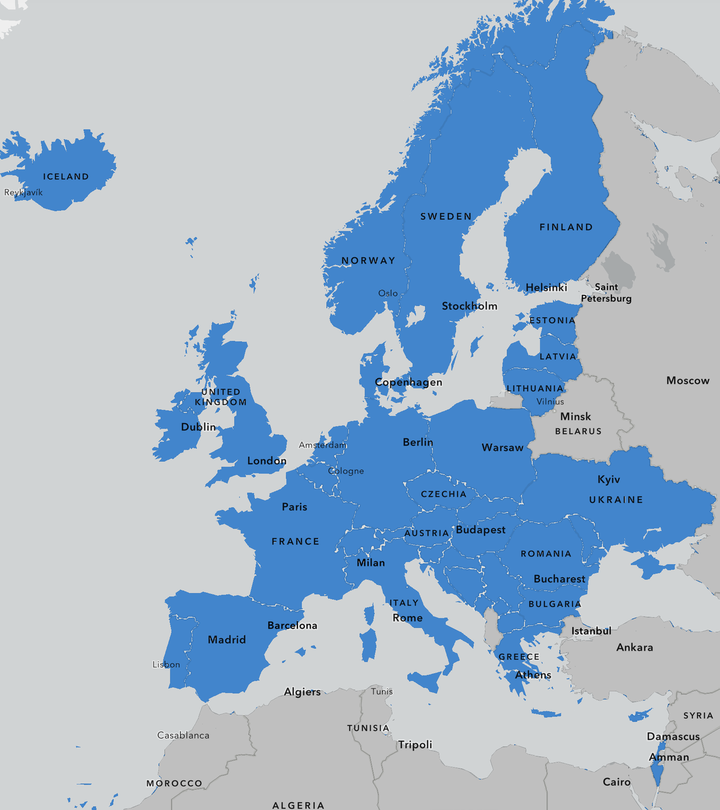

weewx-meteoalarm
=========================

Weather warnings from [**www.meteoalarm.org**](https://www.meteoalarm.org/) for your [WeeWX](https://weewx.com/) station, covering the countries that take part in [**EUMETNET**](https://www.eumetnet.eu.org/). The countries/areas in blue are available.



The extension adds:

* a **warnings page** (`meteoalarm/index.html`) with each warning in every language the national service publishes;
* a **summary box** (`meteoalarm/summary.html`) to show on your main site;
* a **JSON file** (`meteoalarm/meteoalarm.json`) for other programs;
* an **area picker map** ([online](https://millardiang.github.io/weewx-meteoalarm/v1/map/)), used during installation, where you click MeteoAlarm areas or draw your own polygon;
* the **`$meteoalarm` tag**, so any skin can show the warnings in its own templates.


Requirements
------------

WeeWX 5 on Python 3.7 or later (tested with WeeWX 5.5 on Python 3.9 and 3.13). Nothing else to install.

Installing
----------

Install the latest release, 1.0.0:

```sh
weectl extension install https://github.com/Millardiang/weewx-meteoalarm/releases/download/v1.0.0/weewx-meteoalarm-1.0.0.zip
```

Other releases are listed on the [releases page](https://github.com/Millardiang/weewx-meteoalarm/releases), with what changed in [CHANGELOG.md](CHANGELOG.md). To try the latest development version instead, use `https://github.com/Millardiang/weewx-meteoalarm/archive/refs/heads/main.zip`.

The installer asks you to choose your areas on the area map, which is a web page hosted on GitHub Pages:

```
Please select your location(s) from the map. Open this link in a browser on any device:

    https://millardiang.github.io/weewx-meteoalarm/v1/map/#lat=51.48&lon=-0.01&level=2

It opens at your station. Pick your areas or draw a polygon, press 'Copy setup code',
and paste the code here. ...
Setup code (or press Enter to skip):
```

1. Open the link on your computer, tablet or phone. The map starts at your station.
2. Pick areas or draw a polygon (see below).
3. Press **Copy setup code** and paste the code into the terminal. It looks like `MA1:UK258,UK259:2:`.

**Privacy:** the map page is the same for everyone. Your station's position and your current areas are only in the part of the link after `#`, which browsers never send to a website, so they don't leave your device. (Like any website, GitHub sees your IP address, and which countries' outline files the map loads for the part of the map on screen.) Nothing runs on your WeeWX computer for the map, no ports are opened, and the map works wherever your WeeWX website is hosted.

The installer writes your choice into the `[Meteoalarm]` section of `weewx.conf`.

It then asks:

```
Show a warning banner on your Seasons home page when a warning is in force? [Y/n]
```

Answer **Y** (or just press Enter) to get the banner described under *Showing warnings on your main site*. Restart WeeWX; the warning pages and the banner appear after the next report cycle.

**Installing without the map.** Give the areas after the zip:

```sh
weectl extension install weewx-meteoalarm.zip --setup-code="MA1:UK258,UK259:2:"
weectl extension install weewx-meteoalarm.zip --emma-ids=UK258,UK259 --min-level=2
weectl extension install weewx-meteoalarm.zip --polygon="51.3,-0.5 51.7,-0.5 51.7,0.2"
weectl extension install weewx-meteoalarm.zip --no-map          # choose later
```

Add `--banner` or `--no-banner` to decide about the Seasons banner without being asked.

When the install isn't run from a terminal (a script, Ansible and so on) it doesn't ask.

Upgrading
---------

Install the new release's zip the same way. Your `[Meteoalarm]` settings and the Seasons banner are kept; to skip the questions, add `--no-map --no-banner`:

```sh
weectl extension install weewx-meteoalarm-1.1.0.zip --no-map --no-banner
```

Then restart WeeWX. Check [CHANGELOG.md](CHANGELOG.md) first: anything you need to do is listed there, and a new major version number (2.0.0) means something may need changing. Version numbers follow the plan in [RELEASING.md](RELEASING.md). `weectl extension list` shows the version you have.

Changing your areas later
-------------------------

Run

```sh
~/weewx-venv/bin/python3 ~/weewx-data/bin/user/meteoalarm.py --setup
```

(with a Debian/RPM package install: `sudo python3 /etc/weewx/bin/user/meteoalarm.py --setup`). It prints the map link, opening on your current settings; choose again, copy the setup code and paste it. It keeps a dated backup of `weewx.conf`. Then restart WeeWX. `--map-link` just prints the link.

Or open *Or edit weewx.conf yourself* on the map page and paste the settings shown there into `weewx.conf`:

```ini
[Meteoalarm]
    emma_ids = DK002, DK004
    polygon = "57.4272,9.4537 57.3976,10.8820 56.8309,10.8270 56.8610,9.5087 57.4272,9.4537"
    min_level = 2
```

On the map:

* **Pick areas:** click areas to add or remove them, or search by name or EMMA code (e.g. `UK258`, `Wien`). *Near me* jumps to your location.
* **Draw polygon:** click to place corners; click the first corner, double-click or press *Finish* to close it.

The map keeps its link up to date as you choose, so you can bookmark it or reload it without losing your choice.

### What a polygon does

A polygon (CAP style: `lat,lon` pairs separated by spaces) is used in two ways:

1. Every MeteoAlarm area it touches is watched, as if you had listed its EMMA code. This is worked out on your station from the area outlines the skin ships with.
2. Warnings whose own outline (a CAP `polygon` or `circle`) crosses your polygon are shown too, even if they don't name one of your areas. Some services, such as the UK Met Office, draw their warnings this way.

You can use `emma_ids`, `polygon`, or both.

### UK and Switzerland

UK areas are drawn from Office for National Statistics and OSNI county boundaries (see `skins/Meteoalarm/areas/SOURCES.txt`). Greater London and the metropolitan counties are single areas, as they are on MeteoAlarm; Northern Ireland uses its six counties.

There are no public outlines for the Swiss areas, so Switzerland isn't drawn on the map. You can still pick its areas by searching (they're marked *no outline*). A polygon drawn over it still catches warnings that come with their own outline.

Settings
--------

In `[Meteoalarm]` in `weewx.conf`. A `[Meteoalarm]` section in a skin's `skin.conf` overrides these for that skin only.

| Setting | Default | Meaning |
| --- | --- | --- |
| `emma_ids` | *(empty)* | EMMA codes to watch, comma separated |
| `polygon` | *(empty)* | Polygon as `"lat,lon lat,lon ..."` |
| `min_level` | `2` | Lowest level shown: 1 green, 2 yellow, 3 orange, 4 red |
| `cache_max_age` | `300` | Seconds before the feeds are downloaded again |
| `timeout` | `30` | Seconds to wait for each feed |
| `date_format` | `%Y-%m-%d` | [strftime](https://docs.python.org/3/library/datetime.html#strftime-and-strptime-format-codes) format for dates |
| `time_format` | `%H:%M` | strftime format for times |
| `cache_file` | `<SQLITE_ROOT>/meteoalarm-cache.json` | Where downloaded warnings are kept |
| `areas_dir` | `<SKIN_ROOT>/Meteoalarm/areas` | Area names, outlines and geocode aliases |
| `map_url` | the GitHub Pages map | Address of the area map, if you host your own copy (copy `docs/v1/` to any web server) |

Warnings are downloaded while reports are generated, in WeeWX's report thread, and at most once every `cache_max_age` seconds. Each country you watch is one download from meteoalarm.org.

Showing warnings on your main site
----------------------------------

### The Seasons banner (added by the installer)

If you use WeeWX's standard Seasons skin, the installer can add a banner to the top of its home page. It appears only while a warning at your `min_level` or above is in force. It takes the colour of the most severe one and lists each warning, linking to its full text.

The installer adds a short, marked block after `#include "titlebar.inc"` in `skins/Seasons/index.html.tmpl`, and keeps the original as `index.html.tmpl.before-meteoalarm`. The block only loads `meteoalarm/banner.html`, which this extension's report writes each cycle (empty when there are no warnings). Seasons keeps working even if the extension is removed.

Add it later, or take it out, with:

```sh
~/weewx-venv/bin/python3 ~/weewx-data/bin/user/meteoalarm.py --add-banner
~/weewx-venv/bin/python3 ~/weewx-data/bin/user/meteoalarm.py --remove-banner
```

`weectl extension uninstall` can't edit other skins, so run `--remove-banner` **before** uninstalling. If you've already uninstalled, delete the block between the two `meteoalarm banner` comments in `index.html.tmpl`; left in place it just shows nothing.

For another skin, load the same file with the summary-box script below, pointing it at `meteoalarm/banner.html`.

### Option 1: the summary box (any skin, no template changes)

Add this where you want the box, for example in the Seasons skin's `index.html.tmpl`:

```html
<div data-meteoalarm-src="meteoalarm/summary.html"></div>
<script src="meteoalarm/meteoalarm-embed.js" defer></script>
```

The script loads the box, fixes up its links, and refreshes it every five minutes.

### Option 2: the `$meteoalarm` tag in your own templates

Add the search list extension to the other skin's `skin.conf`:

```ini
[CheetahGenerator]
    search_list_extensions = user.meteoalarm.MeteoalarmSearchList
```

Then, for example:

```html
#if $meteoalarm.has_alerts
  #for $a in $meteoalarm.alerts
    <p style="border-left: 6px solid $a.color">
       $a.level_name $a.title,
      $a.onset_text &ndash; $a.expires_text
    </p>
  #end for
#end if
```

Everything text-like is already HTML-escaped. Available tags:

| Tag | Value |
| --- | --- |
| `$meteoalarm.configured` | true if any areas or a polygon are set |
| `$meteoalarm.has_alerts`, `$meteoalarm.count` | whether there are warnings at `min_level` or above, and how many |
| `$meteoalarm.alerts` | list of warnings, most severe first (see below) |
| `$meteoalarm.max_level`, `$meteoalarm.max_color` | highest level in force (including below `min_level`) and its colour |
| `$meteoalarm.summary` | warnings grouped by area: `area`, `country`, `icons` (`color`, `icon`, `title`, `anchor`, `level_name`) |
| `$meteoalarm.area_list` | watched areas: `code`, `name` |
| `$meteoalarm.updated` | when the warnings were last downloaded |
| `$meteoalarm.min_level`, `$meteoalarm.min_level_name` | the `min_level` setting |
| `$meteoalarm.json` | the warnings as JSON |

Each warning in `$meteoalarm.alerts` has: `level` (1-4), `level_name`, `severity`, `color`, `advice`, `title`, `event_type`, `icon` (file name in `icons/`), `anchor` (id on the warnings page), `onset_text`, `expires_text`, `sent_text` (plus `onset`, `expires`, `sent` as datetimes), `sender_name`, `origin_url`, `web`, `areas` (`code`, `desc`, `note`, `country`) and `languages` (`code`, `name`, `headline`, `description`, `instruction`).

Testing a configuration
-----------------------

The module can be run on its own to see what it would show:

```sh
python3 bin/user/meteoalarm.py --emma-ids UK258,DK002
python3 bin/user/meteoalarm.py --polygon "51.4,-0.2 51.6,-0.2 51.6,0.1 51.4,0.1"
```

Add `--json` for the JSON document. `tests/make_fixtures.py` writes sample feeds to `tests/feeds/`; pass `--test-file tests/feeds` to use them instead of downloading.

Rebuilding the area data
------------------------

`skins/Meteoalarm/areas/` holds simplified area outlines (one file per country), an index of names, and the NUTS/FIPS→EMMA alias table. They are built with:

```sh
pip install shapely
python3 tools/build_areas.py geocodes.json [more-areas.geojson ...]
```

`geocodes.json` is the MeteoAlarm area file shipped in the MIT-licensed [`meteoalarm`](https://github.com/NiklasJordan/meteoalarm) Python package (`src/meteoalarm/assets/geocodes.json`). Extra GeoJSON files with the same properties (`code`, `country`, `name`, `type: "EMMA_ID"`) add or replace areas; `tools/build_uk_areas.py` builds the UK file this way from ONS and OSNI data (see its header for the inputs). Names for areas without outlines come from `data/meteoalarm-codenames.json`.

Credits
-------

* Inspired by an original PHP script by Ken True, [saratoga-weather.org](https://saratoga-weather.org/), adapted with permission from wrnWarningEU-CAP.php by Wim van der Kuil, [pwsdashboard.com](https://pwsdashboard.com/).
* Warning data © EUMETNET-METEOalarm and the respective National Meteorological Services, used per the [meteoalarm.org terms and conditions](https://meteoalarm.org/page/terms-and-conditions).

Licensed under the GNU General Public License v3 (see `LICENSE`).
